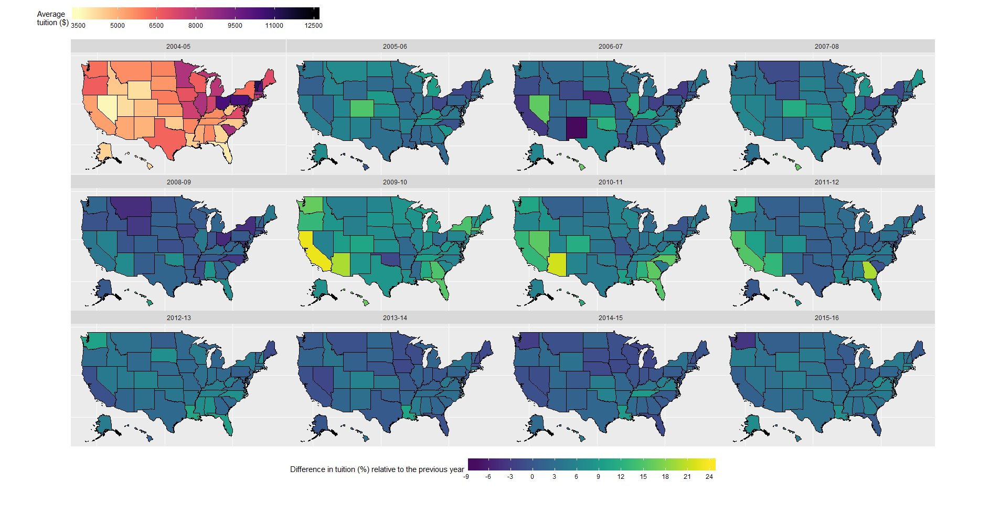

Tidy tuesday is a weekly project that builds off #makeovermonday style projects but aimed at the R ecosystem. An emphasis will be placed on understanding how to summarize and arrange data to make meaningful charts with `ggplot2`, `tidyr`, `dplyr`, and other tools in the `tidyverse` ecosystem.

This repository contains my contributions to the project.

 - Tidy Tuesday 001 - US Tuition

